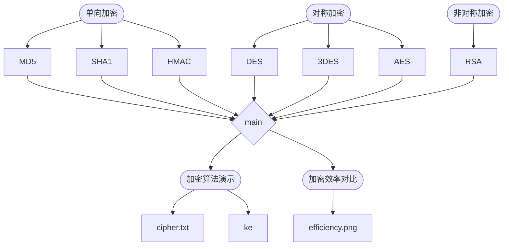

## 信息物理系统安全
### 1. 项目简介

​		本项目通过调用`python`相关的加密库，实现各类加密算法，比较其在效率上的差异，从而设计工业控制信息物理系统网络结构中各层的加密方式。

### 2. 环境配置

1. 运行环境： `python3`
2. 使用的库： `pycryptodome, hmac, hashlib, pdfplumber, numpy，matplotlib`
3. 库的安装： `pip install -i`

### 3. 运行命令

1. 运行： `python3 main.py`

### 4. 目录

​	|- `README.md`				// *help*

​	|- `PPT展示题目.pdf`  	// *明文*

​	|- `code`

​		\ - `main.py`				// *加密算法主函数*

​		\ - `MD5.py`

​		\ - `SHA1.py`

​		\ - `HMAC.py`

​		\ - `DEC.py`

​		\ - `DEC3.py`

​		\ - `AEC.py`

​		\ - `RSA.py`

​	| - `cipher.txt`		 	// *各类算法的运行结果*

​	| - `key`				           // *公钥私钥对*

​		\ - `privateKey.pem`

​		\ - `publivKey.pem`

​	| - `efficiency.png`	 // *加密效率对比*

​	| - `demo.webm`			   // *运行过程演示*

### 5. 代码结构

### 6. 版本

​	$date:6.14$

​	$V1.0$		实现各类加密方法

​	$V1.0.1$    添加注释，修改部分bug

​	$V1.1$        封装，在主函数中实现功能

​	$V1.2$        将加密和解密结果存入`cipher.txt`

​	$V1.2.1$     将`RSA`加密算法中随机生成的公钥私钥对存入`key`

​	$date:6.19$

​	$V2.0$        对大量的数据进行加密，测算每种加密方法的运行时间

​	$V2.1$        加密效率的效果对比可视化

​	$V2.1.1$     对各模块添加详细注释

### 7. 作者

​	$HTY$

### 8. 贡献者

​	$DYH,LMC,PH$

### 9. 参考

​	`CSDN`各路神仙

​	`GitHub`源代码

